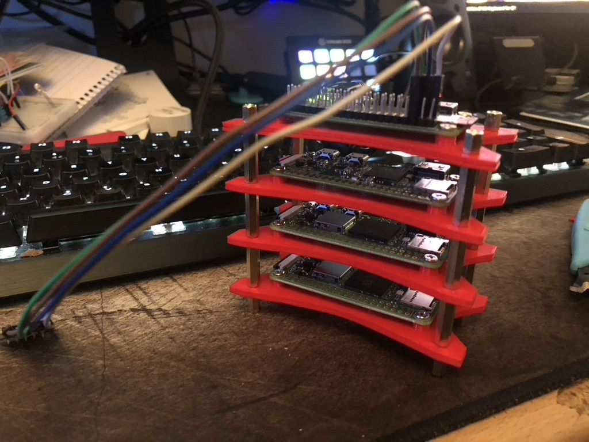

+++
title = "Raspberry Pi 0 W Stack"
author = "Ben Hodgson"
date = "2022-06-22T11:29:00+01:00"
url = "posts/2022/raspi-0-stack/"
image = "/images/2022-thumbs/rpi0-stack.png"
thumbnail = ""
categories = ["3d Printing", "Raspberry Pi", "3d Models", "Stl"]
keywords = ["3d Printing", "Raspberry Pi", "3d Models", "Stl"]
tags = ["3d Printing", "Raspberry Pi", "3d Models", "Stl"]
draft = false
showFullContent = false
+++
<!--more-->

## Raspberry Pi 0W Stack

Over the last few years I have gathered a few Raspberry Pi 0Ws. These had been spaced over my desk either gathering dust while I found something to do with them or they had little things running on them such as my DHT11 and BMP280 for temperature and humidity.

I designed a quick plate to attach the Raspberry Pi 0s to using m2.5 screws. I used some from [this Amazon seller](https://www.amazon.co.uk/gp/product/B0894D654R/ref=ppx_yo_dt_b_asin_title_o05_s00?ie=UTF8&psc=1). As the plates can be stacked I created holes near the corners to fit m2.5 standoff I used [these ones from Amazon](https://www.amazon.co.uk/gp/product/B08HLJ7C6S/ref=ppx_yo_dt_b_asin_title_o05_s00?ie=UTF8&th=1)

The files for the 

